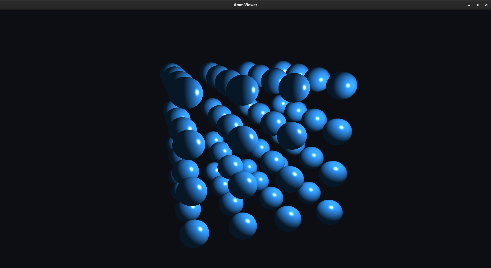

# Lattice Visualizer

A 3D atomic lattice renderer built with C++, OpenGL 4.6, GLFW and GLSL. It draws a grid of lit spheres (atoms) with an orbiting camera.

> Status: in progress. Currently renders a simple-cubic lattice. More lattice types and interactive controls are planned.



## Features

- Procedurally generated sphere mesh (VAO / VBO / EBO)
- Custom GLSL vertex and fragment shaders with Phong lighting (ambient, diffuse, specular)
- 4x4x4 simple-cubic atom grid, centred at the origin
- Auto-orbiting camera
- Modular classes: `Shader`, `Sphere`, `Atom`, `AtomManager`, `AtomRenderer`

## Requirements

- A C++17 compiler (GCC, Clang or MSVC)
- CMake 3.10+
- GPU and driver supporting OpenGL 4.6
- [GLFW](https://www.glfw.org/)
- [GLM](https://github.com/g-truc/glm)
- [GLAD](https://glad.dav1d.de/) (OpenGL 4.6, Core profile)

### Install dependencies on Ubuntu / Debian

```bash
sudo apt update
sudo apt install build-essential cmake libglfw3-dev libglm-dev
```

GLAD is not available as a system package. Generate it at https://glad.dav1d.de/ (Language: C/C++, API gl 4.6, Profile: Core), then copy the `glad/` and `KHR/` include folders and `glad.c` into the project as described in `CMakeLists.txt`.

## Build and run

```bash
git clone https://github.com/rubesh-commits/Lattice-Visualizer.git
cd Lattice-Visualizer
mkdir build && cd build
cmake ..
make
./AtomViewer
```

**Important:** run the program from inside the `build/` folder. Shaders are loaded using the relative path `../shaders/`, so running it from anywhere else will print `Failed to open shader`.

## Project structure

```
src/        C++ source (main, Shader, Sphere, Atom, AtomManager, AtomRenderer)
shaders/    GLSL shaders (atom.vert, atom.frag)
```

## Troubleshooting

| Problem | Fix |
|---|---|
| `Failed to open shader` | Run from the `build/` directory |
| `Failed to create window` | Your GPU or driver may not support OpenGL 4.6. Update drivers, or lower the version in `main.cpp` and the `#version` line in the shaders |
| Black window | Check the terminal for shader compile or link errors |

## Planned

- Lattice types (SC, BCC, FCC) from a unit cell
- Mouse-controlled camera
- Bonds and unit-cell edges
- Instanced rendering for large lattices
